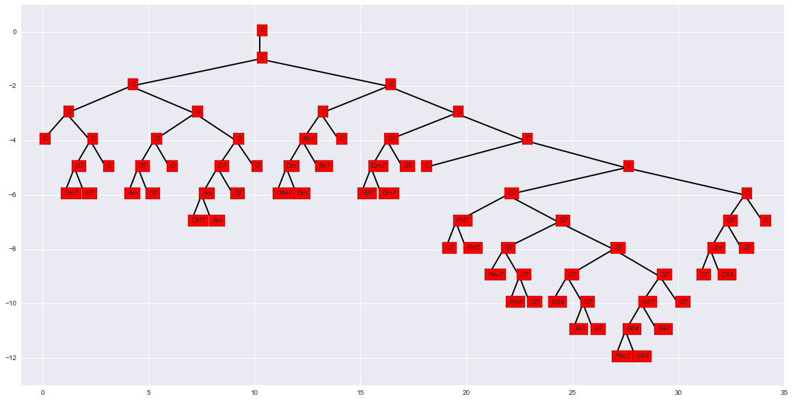

# Tree Parser
A simple tree parser for trees in bracket notation written in python. For example the following code (with default values for `fontdict` and `textkwargs` explicitly specified)
```python
from tree_parser import TreeParser
import matplotlib.pyplot as plt
fig, ax = plt.subplots(1, 1, figsize=(20, 10))
string = "[C[C[C[C[C][C[G7[Dm7][G7]][C]]][G[G[D7[Am][D7]][G]][G[D7[Am[CM7][Am]][D7]][G]]]][C[C[Bo7[Dm[C#o7][Dm]][Bo7]][C]][C[G7[Dm7[FM7][Dm7]][G7]][C [C][C[G7[FM7[C7][FM7]][G7[G7[F#o7][G7[Fm6][G7]]][G7[G7[G64][G7[G47][G7]]][G7[G47[G64[F#o7][G64]][G47]][G7]]]]][C[G7[C64[C7][C64]][G7]][C]]]]]]]]"
parser = TreeParser(string, True)
parser.plot(ax=ax, padding=1, fontdict={'fontsize': 12}, textkwargs={'bbox': {'facecolor': 'red', 'pad': 10}, 'style': 'italic'})
```
results in: 
